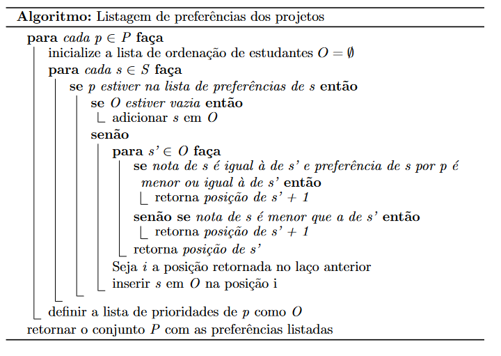

# P2 (TAG - 2021.1 - 202033202): Algoritmo Gale-Shapley
Projeto 2 de Teoria e Aplicação de Grafos, disciplina ofertada na Universidade de Brasília (UnB) no semestre 2021.1.
Desenvolvido por Gabriel Mendes Ciriatico Guimarães, de matrícula 202033202.

## Algoritmo adaptado

O algoritmo Gale-Shapley desenvolvido se baseou em duas versões: a de X, focada em emparelhamento de casais, com formação de pares; e a de Y, de onde foi analisado o algoritmo que dava prioridade a aulas, ao invés de estudantes.

Essas duas adaptações que foram usadas como base para este projeto partem do princípio de que há listas de preferências de ambos os conjuntos dados já feitas. O arquivo entradaProj2TAG.txt, que contém os dados sobre alunos e projetos, dá apenas as listas de preferências dos alunos.

Por isso, foi desenvolvido também um algoritmo para criação das listas de preferência dos projetos, levando em consideração: se o estudante tinha interesse pelo projeto; sua nota; e, por fim, sua preferência. O primeiro critério era eliminatório (se um aluno não tinha interesse em um projeto, não entrava na lista desse projeto), enquanto o segundo e o terceiro foram usados em ordenamento.

O pseudocódigo abaixo mostra a criação dessas listas:

<p align="center"></p>

Já para o algoritmo Gale-Shapley adaptado para o emparelhamento estável máximo de projetos e estudantes pode ser visto abaixo. Note que a preferência é dada para os projetos na escolha, e não para os estudantes.

<p align="center"></p>

## Compilação
Para utilizar o projeto desenvolvido, certifique-se que os arquivos .py e .txt estão na mesma pasta.

Depois, compile o arquivo .py no terminal.

```console
python tag_p2_202033202.py
```

## Resultados

Após a compilação, serão imprimidas informações sobre o emparelhamento máximo estável obtido:

<ul>
<li>10 primeiras iterações dentro do laço no algoritmo, com duplas inscrições realizadas em cada iteração;</li>
<li>Informações gerais sobre o emparelhamento máximo estável obtido, com número de projetos totalmente preenchidos e projetos descartados por terem vagas sobrando;</li>
<li>Informações detalhadas sobre os projetos formados, com os estudantes de cada um;</li>
<li>Informações sobre os projetos descartados, com número de vagas sobrando.</li>
</ul>

## License
[MIT](https://choosealicense.com/licenses/mit/)
